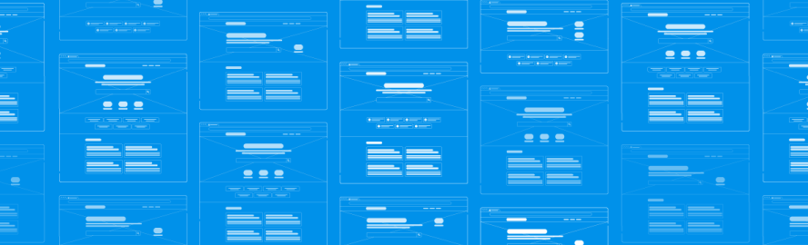
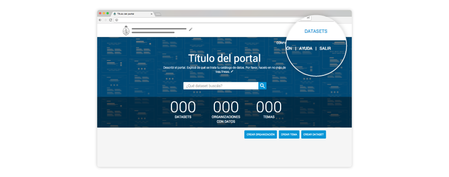
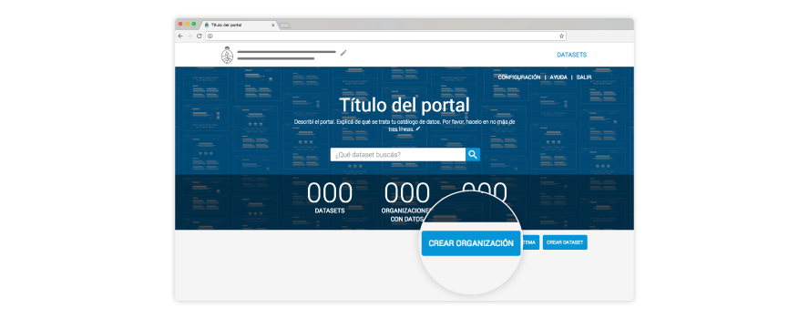
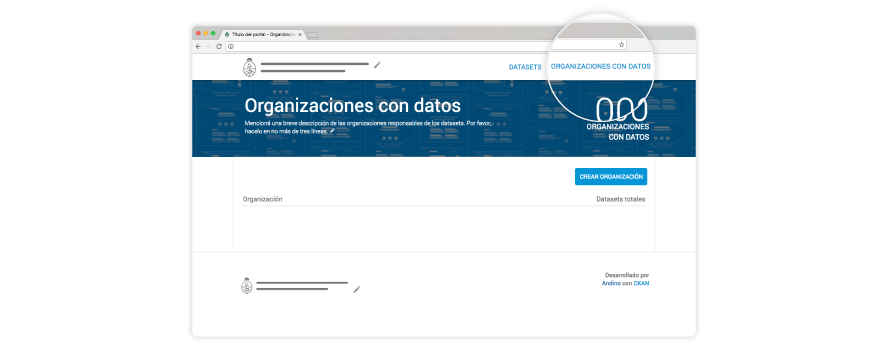
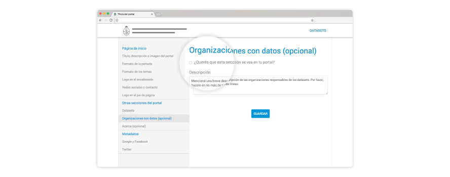
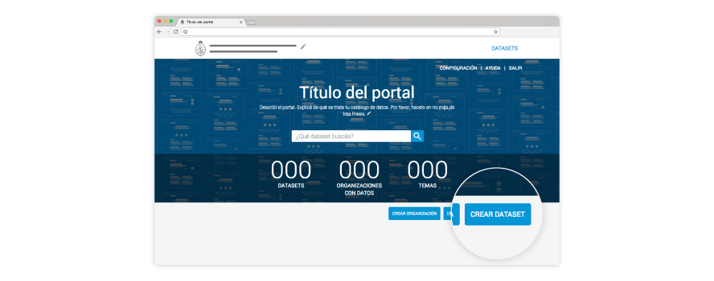
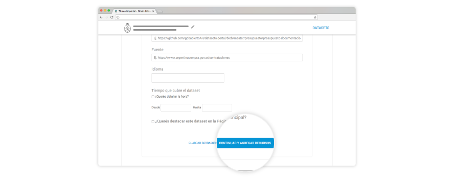
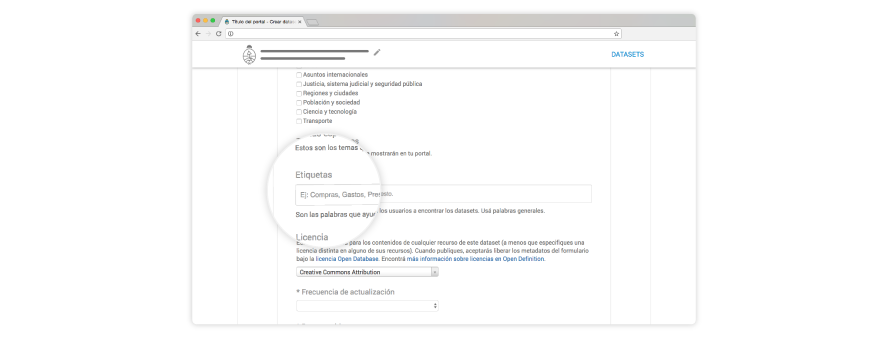

# Guía de uso Portal Andino

<!-- START doctoc generated TOC please keep comment here to allow auto update -->
<!-- DON'T EDIT THIS SECTION, INSTEAD RE-RUN doctoc TO UPDATE -->

- [Primeros pasos](#primeros-pasos)
- [Entrar y salir de tu portal](#entrar-y-salir-de-tu-portal)
- [Elementos de tu portal](#elementos-de-tu-portal)
  - [Organizaciones](#organizaciones)
  - [Sección Organizaciones con datos](#secci%C3%B3n-organizaciones-con-datos)
  - [Temas](#temas)
  - [Datasets](#datasets)
  - [Recursos](#recursos)
  - [Etiquetas](#etiquetas)
- [Personalizar el portal](#personalizar-el-portal)
- [Otros contenidos útiles](#otros-contenidos-%C3%BAtiles)

<!-- END doctoc generated TOC please keep comment here to allow auto update -->

## Primeros pasos

**¡Un aplauso, ya estás abriendo tus datos!**

Esta guía te ayudará a:

* Conocer los elementos del catálogo e identificar dónde se ven en el portal.
* Personalizar el portal.
* Crear datasets, recursos, organizaciones y temas.

¡Arranquemos!

***

## Entrar y salir de tu portal

Para poder entrar y salir de tu portal, **es necesario que tu administrador haya creado un usuario y contraseña**. Con esa información, cada vez que quieras entrar al portal, **podrás hacerlo desde http://*tu-url.com*/ingresar**.

**Para salir**, sólo tenés que **hacer clic en el botón en el margen superior derecho**.

**¿Y si olvidé mi contraseña?**

Por el momento, tanto la creación del usuario y la contraseña, como la recuperación de esta última sólo podrá hacerla quien se haya encargado de instalarte Andino. 

***

## Elementos de tu portal

### Organizaciones 

Son los organismos que abren o mantienen cada dataset. **Es muy importante que crees las organizaciones antes de que generes un dataset** que esté asociado a ella. 

##### ¿Dónde lo veo en el portal?

* Como elemento descriptivo, en cada dataset. 

* Como número agregado, en la Página principal de tu portal, en caso de que hayas elegido la vista que muestra el número de Organizaciones con datos.

//Imagenx3-Agregar//

##### Buenas prácticas al crear Organizaciones con datos

Tené en cuenta que **siempre que borres una organización, todos los conjuntos de datos (y también los recursos), se borrarán** definitivamente. 

##### ¿Cómo los creo?

Andá a **Página principal > Crear Organizaciones**.

En caso de que hayas elegido que tu portal tenga una sección de Organizaciones con datos, también se mostrarán allí. 

***
### Sección Organizaciones con datos

**Esta sección es opcional**. Te permite armar un árbol de jerarquías con las organizaciones que abrieron datos en tu portal. Los organismos que se muestran en esta parte de tu portal son los mismos que asignás a los datasets y que creas antes de generar estos últimos. 

##### ¿Dónde lo veo en el portal?

En Página principal > **Organizaciones con datos**.

##### Buenas prácticas al crear la sección Organizaciones con datos

Es importante que tengas bien en claro qué organizaciones dependenden de otras, para que el árbol de jerarquías represente bien las correspondencias. 

##### ¿Cómo las creo?

Como la sección Organizaciones con datos es opcional, podés elegir que se vea en tu portal. Para eso, **andá a Configuraciones > Organizaciones con datos** y tildá la habilitación. 

***
### Temas

Son las categorías en las que se pueden clasificar todos los datasets de tu portal. Hay dos taxonomías de temas:

*  **Temas globales**, que ya vienen con AbreAr, y que necesitás elegir para cada dataset. Estos temas no se ven en tu portal, pero es necesario que lo elijas para que el portal nacional datos.gob.ar pueda republicar el dataset según esta clasificación. Por ejemplo: “Economía y finanzas”. 

* **Temas específicos**, que son opcionales, pero que te recomendamos con énfasis que agregues a todos tus conjuntos de datos porque son los temas que van a ver tus usuarios. Por ejemplo, si el tema global era “Economía y finanzas”, un tema específico podría ser “Compras”. 

##### ¿Dónde lo veo en el portal?

* En la Página principal de tu catálogo de datos. 

//Imagen de la home con temas ya cargados//

* También como detalle de cada dataset específico.

//Imagen de la sec dataset y en un dataset en particular//

##### Buenas prácticas al crear Temas específicos

* Intentá crear los temas específicos a conciencia para poder reutilizarlos a futuro. 
* No crees un tema específico por cada dataset.
* Asegurate de que cada tema específico sea un aparte más pequeña dentro de los Temas globales. 

##### ¿Cómo los creo?

**Cada vez que generes un nuevo dataset**, el formulario te pedirá que asignes temas. Recordá siempre reutilizar los que ya hayas creado y no repetirlos.  

//Imagen del form con zoom en la parte de temas//
***
### Datasets

También los llamamos “conjuntos de datos”. Son la pieza principal de tu portal o catálogo de datos. Cada dataset está formado por uno o más recursos. 

##### ¿Dónde los veo en el portal?

Todos los datasets que subas al portal se verán **en la sección Datasets**. Además, **podrás destacar** los que creas más importantes en la Página principal.

//Imagen de la home. Remarcada sección dataset + recorte/zoom de cómo se verán los datasets destacados//

##### Buenas prácticas al crear datasets

* **Títulos de los datasets**: es el primer vistazo que los usuarios tendrán sobre su contenido. Por eso, intentá no superar los 100 caracteres. Prestá especial atención a las mayúsculas. Sólo los sustantivos propios las necesitan. 

* **Descripción de los datasets**: es el detalle que le contás a los usuarios. Por esa razón, es importante que trates de dar una explicación general de los datos con los que se va a encontrar. Intentá no superar los 500 caracteres.

##### ¿Cómo los creo?

Ingresá a tu cuenta y andá a **Página principal > Crear dataset**.

**Siempre podrás editar los dataset** que hayas creado. Para eso, ingresá a tu cuenta > Página principal > Datasets > **Editar dataset**. 
***
### Recursos

Cada dataset está formado por, al menos, un recurso. Por eso decimos que los recursos son la pieza de información más pequeña del catálogo y los verdaderos activos de datos del portal. 

##### ¿Dónde los veo en el portal?

Página principal > Datasets > Clic en el recurso específico.

##### Buenas prácticas al crear recursos
Seguí los mismos criterios de escritura que con los datasets. 

* **Títulos de los recursos**: intentá no superar los 150 caracteres. 

* **Descripción de los recursos**: intentá no superar los 200 caracteres.

##### ¿Cómo los creo?

Ingresá a tu cuenta y andá a Página principal > Crear dataset. Una vez que completes el dataset, podrás agregar recursos. 

Al igual que con los datasets, siempre podrás editar los recursos que hayas creado. Para eso, ingresá a tu cuenta > Página principal > Datasets > Editar dataset > Editar recursos. 
***
### Etiquetas

Son las palabras que ayudan a los usuarios a filtrar y encontrar los datasets. Cuanto más amplia y uniforme sea la lista de Etiquetas, mayor es su poder de ayuda. 

##### ¿Dónde las veo en el portal?

En cada dataset específico. 

##### Buenas prácticas al crear etiquetas

* Usá mayúsculas sólo donde corresponda.
* Identificá palabras claves.
* Respetá las etiquetas anteriores.
* Agregá sinónimos y usá lenguaje natural.
* Tratá de usar una sola palabra, siempre en plural.
* Si la etiqueta tiene más de una palabra, separalas por un espacio. Por ejemplo: “declaraciones juradas”.

Estas son algunas preguntas útiles a la hora de pensar las etiquetas:

* ¿Cuál es el tema?
* ¿Qué aspectos serán de interés para los usuarios?
* ¿De qué otro modo buscaría el usuario esta información?
* ¿De qué tipo de información se trata?
* ¿Qué área la provee?

#####  ¿Cómo los creo?

Al igual que con los Temas, cada vez que generes un nuevo dataset, el formulario te pedirá que asignes un etiqueta. Recordá siempre reutilizar las que ya hayas creado y no repetirlas.  

//Imagen del form con zoom en la parte de etiquetas//

//Imagen tipo portacda. Ver con quien lo implemente tamaños y formatos//
***
### Personalizar el portal

Hacer que tu portal represente tu organización es muy fácil. Por favor, **andá a la Página principal > Configuración**. Llegarás a la sección que te permite cambiar cómo luce la portada de tu catálogo de datos y cada sección en particular.

//Imagen de la home con config remarcado + imagen del form//
***
### Otros contenidos útiles

* Glosario.
* Kit de Datos abiertos.
* Guía para el uso y la publicación de metadatos.
* Guía para la identificación y uso de entidades interoperables.
* Guía para la publicación de datos en formatos abiertos.

